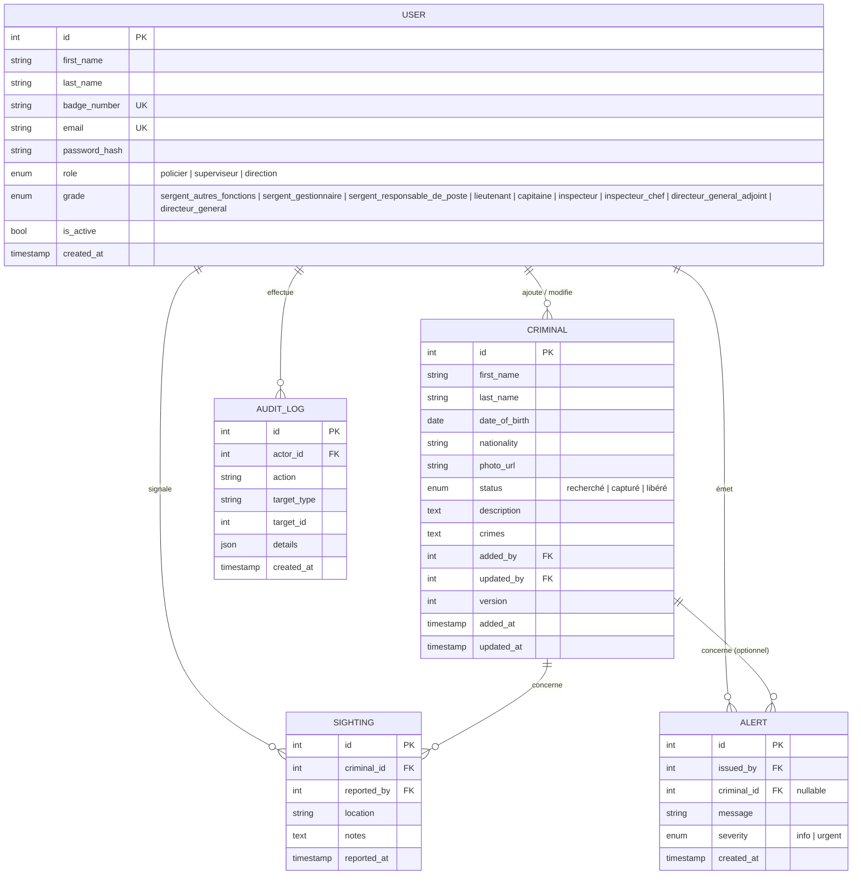

# Conception technique — CrimeTracker

> Ce document est conçu pour le sprint 1
---

## Modèle de données initial



### Notes sur le sprint 1
- `CRIMINAL.version` : entier incrémenté à chaque mise à jour — sert au verrouillage optimiste (sprint 3, récit #13). En sprint 1, on le stocke sans l'exploiter encore.
- `CRIMINAL.crimes` : stocké en texte libre pour le sprint 1 ; normalisé en table séparée si besoin au sprint 2.
- `SIGHTING` et `ALERT` : entités créées au sprint 1 au niveau du schéma, fonctionnellement activées au sprint 2.
- `AUDIT_LOG` : conserve les actions sensibles (promotion, désactivation de compte, retrait de dossier et diffusion d'alerte) avec leur auteur, leur cible et la date; sa consultation est prévue au sprint 3.
- Contraintes de rôle : `policier` est associé au grade « sergent autres fonctions », `superviseur` aux grades de sergent gestionnaire à inspecteur-chef et `direction` aux grades de directeur général adjoint ou directeur général. Une promotion valide le grade avant de modifier le rôle.

---

## Principales routes

### Pages (React Router v7 — rendu serveur)

| Route | Rôle | Rendu |
|---|---|---|
| `GET /login` | Formulaire de connexion | SSR |
| `GET /` | Tableau de bord (alertes temps réel) | SSR + hydratation client |
| `GET /criminals` | Liste paginée avec filtres | SSR |
| `GET /criminals/:id` | Profil complet d'un dossier | SSR |
| `GET /criminals/new` | Formulaire d'ajout (policier) | SSR |

### API (actions React Router / endpoints)

| Méthode | Route | Description | Rôle requis |
|---|---|---|---|
| `POST` | `/auth/login` | Authentification, retourne cookie de session | — |
| `POST` | `/auth/logout` | Invalidation de session | Authentifié |
| `GET` | `/api/criminals` | Liste paginée, filtrable par nom et statut | `policier` |
| `POST` | `/api/criminals` | Créer un dossier | `policier` |
| `GET` | `/api/criminals/:id` | Détail d'un dossier | `policier` |
| `PATCH` | `/api/criminals/:id` | Mettre à jour statut (avec `version`) | `policier` |
| `DELETE` | `/api/criminals/:id` | Retirer un dossier | `superviseur` |
| `POST` | `/api/sightings` | Signaler une observation | `policier` |
| `GET` | `/api/users` | Liste des comptes policiers et superviseurs | `superviseur` ou `direction` |
| `POST` | `/api/users` | Créer un compte policier | `superviseur` |
| `PATCH` | `/api/users/:id/status` | Désactiver ou réactiver un compte policier | `superviseur` |
| `PATCH` | `/api/users/:id/promotion` | Promouvoir un policier et modifier son grade | `direction` |
| `GET` | `/api/audit-logs` | Consulter le journal des actions sensibles | `direction` |
| `GET` | `/api/criminals/:id/sightings` | Consulter l'historique des signalements | `superviseur` |

La route de promotion accepte un grade supérieur, change le rôle applicatif vers `superviseur`, invalide les anciennes permissions de policier et ajoute une entrée au journal d'audit. Un policier ne peut pas modifier son propre rôle.

Exemple de requête :

```json
{
    "role": "superviseur",
    "grade": "lieutenant"
}
```

### Événements Socket.IO (sprint 2–3)

| Direction | Événement | Payload | Déclencheur |
|---|---|---|---|
| Serveur → clients | `criminal:added` | `{ criminal }` | Nouveau dossier créé |
| Serveur → clients | `criminal:updated` | `{ id, status, updated_by, updated_at }` | Statut modifié |
| Serveur → clients | `criminal:removed` | `{ id }` | Dossier retiré |
| Serveur → clients | `alert:broadcast` | `{ id, message, severity, issued_by, created_at }` | Alerte urgente émise |
| Serveur → clients | `presence:update` | `{ online_users[] }` | Connexion / déconnexion |
| Client → serveur | `alert:send` | `{ message, severity, criminal_id? }` | Superviseur diffuse une alerte |

Les changements de statut, les nouveaux dossiers et les alertes sont diffusés à tous les clients authentifiés; la liste de présence contient uniquement les comptes actifs.

---

## Maquettes

Les maquettes se trouvent dans le dossier [`maquettes/`](maquettes/).

| Fichier | Écran |
|---|---|
| `CrimeTracker-mobile-connexion.pdf` | Connexion par matricule et mot de passe |
| `CrimeTracker-mobile-ajout-personne-recherchee.pdf` | Ajout d'un dossier de personne recherchée |
| `CrimeTracker-mobile-alertes-temps-reel.pdf` | Alertes et communiqués diffusés en temps réel |
| `CrimeTracker-mobile-gestion-utilisateurs.pdf` | Gestion des utilisateurs et activation des comptes |

---

## Registre de décisions

### Décision 1 — Authentification à deux facteurs

**Question** : comment sécuriser la connexion des policiers, des superviseurs et de la direction ?

**Options envisagées** :
- Badge et mot de passe seuls : simple, mais un mot de passe volé ou deviné suffit pour accéder au registre.
- Badge, mot de passe et code envoyé par courriel ou SMS : ajoute une étape, mais dépend d'un service externe.
- Badge, mot de passe et code généré par une application d'authentification (TOTP) : ajoute une étape, sans dépendre d'un envoi externe.

**Choix retenu** : badge, mot de passe et code généré par une application d'authentification.

**Raison** : le registre contient des informations sensibles sur des personnes recherchées; un accès non autorisé aurait des conséquences importantes. Le deuxième facteur limite le risque qu'un mot de passe compromis suffise à se connecter, et un code TOTP ne dépend pas de la disponibilité d'un service de courriel ou de SMS.

**Prix de ce choix** : chaque policier doit configurer une application d'authentification avant sa première connexion, et une procédure de récupération doit être prévue en cas de perte de l'appareil.

---

### Décision 2 — PostgreSQL avec verrouillage optimiste pour la concurrence

**Question** : comment gérer deux policiers qui modifient le même dossier simultanément ?

**Options envisagées** :
- Verrouillage pessimiste (`SELECT FOR UPDATE`) : bloque la ressource pendant la transaction
- Verrouillage optimiste (champ `version`) : détecte le conflit au moment de l'écriture
- Pas de gestion (dernier écrit gagne — `last-write-wins`)

**Choix retenu** : verrouillage optimiste avec champ `version` dans la table `CRIMINAL`.

**Raison** : les conflits simultanés seront rares (deux policiers sur le même dossier au même instant). Le verrouillage pessimiste pénaliserait inutilement tous les policiers. Le `last-write-wins` ne respecte pas l'exigence du projet.

**Prix de ce choix** : le client doit envoyer le numéro de version courant avec chaque mise à jour, et gérer le cas de rejet en affichant le statut actuel.

---

### Décision 3 — Socket.IO plutôt que Server-Sent Events (SSE) pour le temps réel

**Question** : comment diffuser les alertes et les changements en temps réel ?

**Options envisagées** :
- WebSockets natifs : contrôle complet, mais reconnexion à gérer manuellement.
- Socket.IO : reconnexion automatique et événements nommés.
- Server-Sent Events (SSE) : communication principalement du serveur vers les clients.
- Polling : simple, mais moins réactif et plus coûteux en requêtes.

**Choix retenu** : Socket.IO.

**Raison** : Socket.IO permet de diffuser les alertes, les changements de statut et la présence des policiers sans rechargement. Il gère aussi la reconnexion et la communication bidirectionnelle.

**Fonctionnement** : le serveur authentifie la session, enregistre l'action dans PostgreSQL, puis diffuse l'événement aux clients connectés.

**Deux alertes simultanées** : chaque alerte est enregistrée séparément dans `ALERT` avec un identifiant unique. Aucune alerte n'écrase l'autre; les deux sont ensuite diffusées aux clients.

**Déconnexion et erreurs** : Socket.IO tente automatiquement de se reconnecter. Une alerte qui n'est pas enregistrée n'est pas diffusée.

**Prix de ce choix** : Socket.IO ajoute une dépendance et une configuration supplémentaire avec Docker, mais il est plus adapté que SSE à la communication bidirectionnelle.
