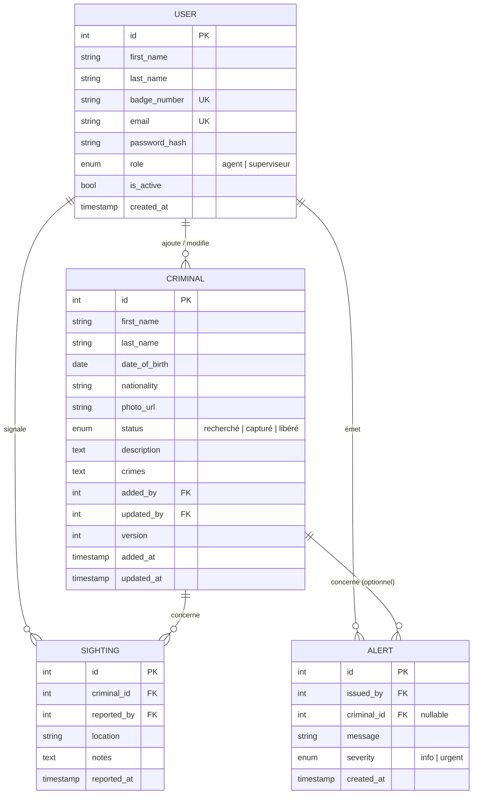

# Conception technique — CrimeTracker

> Ce document est conçu à la profondeur du sprint 1 : précis là où le sprint 1 travaille, esquissé pour la suite.

---

## Modèle de données initial

### Notes sur le sprint 1
- `CRIMINAL.version` : entier incrémenté à chaque mise à jour — sert au verrouillage optimiste (sprint 3, récit #13). En sprint 1, on le stocke sans l'exploiter encore.
- `CRIMINAL.crimes` : stocké en texte libre pour le sprint 1 ; normalisé en table séparée si besoin au sprint 2.
- `SIGHTING` et `ALERT` : entités créées au sprint 1 au niveau du schéma, fonctionnellement activées au sprint 2.

---

## Principales routes

### Pages (React Router v7 — rendu serveur)

| Route | Rôle | Rendu |
|---|---|---|
| `GET /login` | Formulaire de connexion | SSR |
| `GET /` | Tableau de bord (alertes temps réel) | SSR + hydratation client |
| `GET /criminals` | Liste paginée avec filtres | SSR |
| `GET /criminals/:id` | Profil complet d'un dossier | SSR |
| `GET /criminals/new` | Formulaire d'ajout (superviseur) | SSR |

### API (actions React Router / endpoints)

| Méthode | Route | Description | Rôle requis |
|---|---|---|---|
| `POST` | `/auth/login` | Authentification, retourne cookie de session | — |
| `POST` | `/auth/logout` | Invalidation de session | Authentifié |
| `GET` | `/api/criminals` | Liste paginée, filtrable | `agent` |
| `POST` | `/api/criminals` | Créer un dossier | `superviseur` |
| `GET` | `/api/criminals/:id` | Détail d'un dossier | `agent` |
| `PATCH` | `/api/criminals/:id` | Mettre à jour statut (avec `version`) | `agent` |
| `DELETE` | `/api/criminals/:id` | Retirer un dossier | `superviseur` |
| `POST` | `/api/sightings` | Signaler une observation | `agent` |
| `GET` | `/api/users` | Liste des agents (superviseur) | `superviseur` |
| `POST` | `/api/users` | Créer un compte agent | `superviseur` |

### Événements Socket.IO (sprint 2–3)

| Direction | Événement | Payload | Déclencheur |
|---|---|---|---|
| Serveur → clients | `criminal:added` | `{ criminal }` | Nouveau dossier créé |
| Serveur → clients | `criminal:updated` | `{ id, status, updated_by, updated_at }` | Statut modifié |
| Serveur → clients | `criminal:removed` | `{ id }` | Dossier retiré |
| Serveur → clients | `alert:broadcast` | `{ message, severity, issued_by }` | Alerte urgente émise |
| Serveur → clients | `presence:update` | `{ online_users[] }` | Connexion / déconnexion |
| Client → serveur | `alert:send` | `{ message, severity, criminal_id? }` | Superviseur diffuse une alerte |

---

## Maquettes

Les maquettes se trouvent dans le dossier [`maquettes/`](maquettes/).

| Fichier | Écran |
|---|---|
| `01-login.png` | Page de connexion |
| `02-dashboard.png` | Tableau de bord temps réel (alertes, présence agents) |
| `03-criminals-list.png` | Liste des dossiers avec filtres |
| `04-criminal-profile.png` | Profil complet d'un dossier |
| `05-add-criminal.png` | Formulaire d'ajout (superviseur) |

---

## Registre de décisions

### Décision 1 — React Router v7 plutôt que Next.js

**Question** : quel cadriciel *full stack* choisir ?

**Options envisagées** :
- React Router v7 (mode *framework*)
- Next.js 15 (App Router)
- SvelteKit

**Choix retenu** : React Router v7.

**Raison** : c'est la pile enseignée dans le cours Applications web 2, ce qui garantit un support pédagogique direct. La colocation des loaders/actions avec les routes correspond au modèle mental qu'on développe en cours.

**Prix de ce choix** : écosystème moins mature que Next.js pour certains cas (ISR, image optimisation). On accepte ce compromis.

---

### Décision 2 — PostgreSQL avec verrouillage optimiste pour la concurrence

**Question** : comment gérer deux agents qui modifient le même dossier simultanément ?

**Options envisagées** :
- Verrouillage pessimiste (`SELECT FOR UPDATE`) : bloque la ressource pendant la transaction
- Verrouillage optimiste (champ `version`) : détecte le conflit au moment de l'écriture
- Pas de gestion (dernier écrit gagne — `last-write-wins`)

**Choix retenu** : verrouillage optimiste avec champ `version` dans la table `CRIMINAL`.

**Raison** : les conflits simultanés seront rares (deux agents sur le même dossier au même instant). Le verrouillage pessimiste pénaliserait inutilement tous les agents. Le `last-write-wins` ne respecte pas l'exigence du projet.

**Prix de ce choix** : le client doit envoyer le numéro de version courant avec chaque mise à jour, et gérer le cas de rejet en affichant le statut actuel.

---

### Décision 3 — Socket.IO plutôt que Server-Sent Events (SSE) pour le temps réel

**Question** : quelle technologie pour le tableau de bord temps réel ?

**Options envisagées** :
- WebSockets natifs
- Socket.IO (abstraction WebSocket)
- Server-Sent Events (SSE, flux unidirectionnel serveur → client)
- Polling toutes les N secondes

**Choix retenu** : Socket.IO.

**Raison** : la diffusion d'alertes et la présence des agents nécessitent un canal bidirectionnel (le client envoie aussi des alertes vers le serveur). Socket.IO est enseigné dans le cours Applications web 2 et gère automatiquement la reconnexion.

**Prix de ce choix** : dépendance supplémentaire, complexité de configuration avec Docker (CORS, transport). SSE aurait été plus simple pour un flux purement serveur → client.
