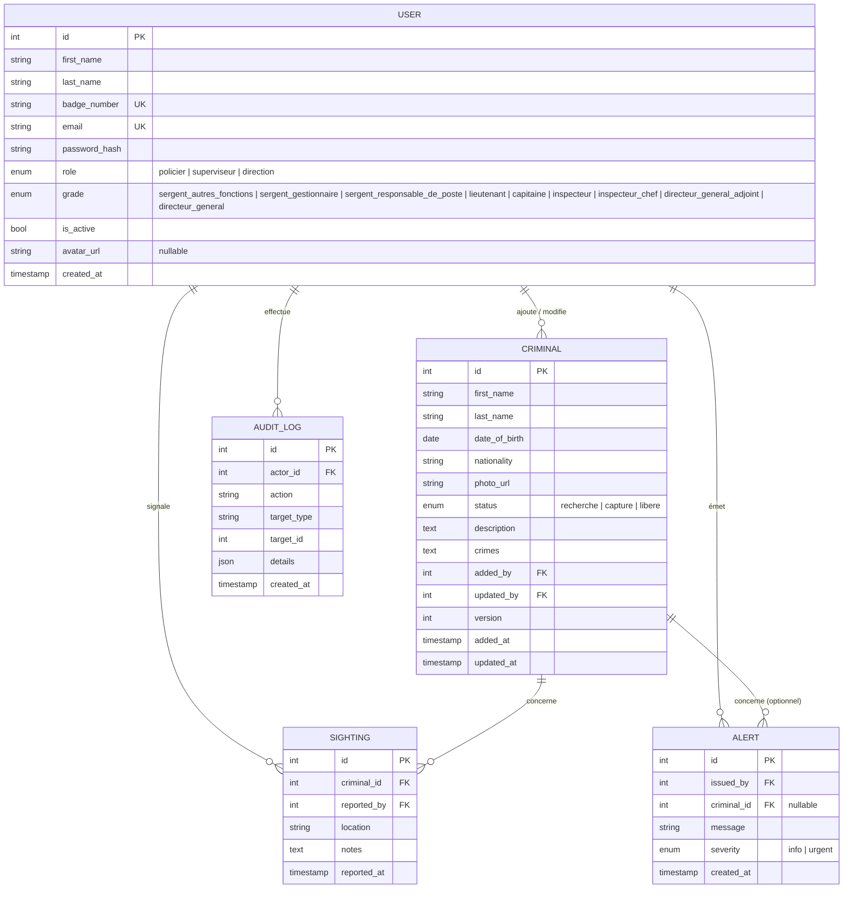

# Conception technique — CrimeTracker

> Mis à jour à la fin du sprint 1 : le modèle de données décrit ce qui est réellement dans la base (`backend/serveur/database/schema.sql`), et le registre de décisions s'allonge des choix faits pendant le sprint (décisions 4 à 9).

---

## Architecture réelle (sprint 1)

```text
Navigateur ── http://localhost:8080 ──► nginx (conteneur client)
                                          ├─ /            → application React compilée (Vite)
                                          ├─ /api/…       → API Express (conteneur api, port 3000)
                                          └─ /socket.io/  → Socket.IO (même conteneur api)
                                                               │
                                                               ▼
                                                    PostgreSQL 16 (conteneur postgres, volume persistant)
```

- **Frontend** : React 19 + Vite, application monopage (`react-router-dom` côté client). En développement, le serveur Vite (port 5173) relaie `/api` et `/socket.io` vers l'API.
- **Backend** : Node.js + Express, organisé en `routes → controllers → services → models`. Socket.IO tourne sur le même serveur HTTP.
- **Base de données** : PostgreSQL 16. L'API crée les tables (`schema.sql`) et insère les données de départ (`seed.sql`) au démarrage si la base est vide.
- **Docker** : `compose.yml` démarre les trois services (`postgres`, `api`, `client`) avec une seule commande.

---

## Modèle de données


```mermaid
erDiagram
    USER {
        int id PK
        string first_name
        string last_name
        string badge_number UK
        string email UK
        string password_hash
        enum role "policier | superviseur | direction"
        enum grade "sergent_autres_fonctions | sergent_gestionnaire | sergent_responsable_de_poste | lieutenant | capitaine | inspecteur | inspecteur_chef | directeur_general_adjoint | directeur_general"
        bool is_active
        string avatar_url "nullable"
        timestamp created_at
    }
    CRIMINAL {
        int id PK
        string first_name
        string last_name
        date date_of_birth
        string nationality
        string photo_url
        enum status "recherche | capture | libere"
        text description
        text crimes
        int added_by FK
        int updated_by FK
        int version
        timestamp added_at
        timestamp updated_at
    }
    SIGHTING {
        int id PK
        int criminal_id FK
        int reported_by FK
        string location
        text notes
        timestamp reported_at
    }
    ALERT {
        int id PK
        int issued_by FK
        int criminal_id FK "nullable"
        string message
        enum severity "info | urgent"
        timestamp created_at
    }
    AUDIT_LOG {
        int id PK
        int actor_id FK
        string action
        string target_type
        int target_id
        json details
        timestamp created_at
    }

    USER ||--o{ CRIMINAL : "ajoute / modifie"
    USER ||--o{ SIGHTING : "signale"
    USER ||--o{ ALERT : "émet"
    USER ||--o{ AUDIT_LOG : "effectue"
    CRIMINAL ||--o{ SIGHTING : "concerne"
    CRIMINAL ||--o{ ALERT : "concerne (optionnel)"
```

### Notes sur le sprint 1
- `USER.avatar_url` : ajouté pendant le sprint pour la photo de profil (page « Mon profil »). Chemin de l'image servie par l'API, ou `null` pour afficher les initiales. Comme `schema.sql` ne s'applique pas à une base existante, l'API ajoute la colonne au démarrage (`ALTER TABLE … ADD COLUMN IF NOT EXISTS`, voir décision 7).
- `CRIMINAL.version` : **déjà exploité au sprint 1**, plus tôt que prévu. Un déclencheur PostgreSQL (`trg_bump_criminal_version`) l'incrémente à chaque `UPDATE`, et `PATCH /api/criminals/:id/status` exige la version affichée par le client : si elle a changé entre-temps, l'API répond `409` avec l'état actuel du dossier. Il reste au frontend à afficher ce conflit (récit #13).
- `CRIMINAL.crimes` : stocké en texte libre pour le sprint 1 ; normalisé en table séparée si besoin au sprint 2.
- `CRIMINAL.status` : les valeurs de l'énumération sont sans accents (`recherche`, `capture`, `libere`), pour éviter les problèmes d'encodage entre la base, l'API et le frontend. Les libellés accentués sont ajoutés à l'affichage.
- `SIGHTING` et `ALERT` : leurs routes existent déjà dans l'API (création et lecture); leurs écrans ne sont pas encore faits.
- `AUDIT_LOG` : les actions `CRIMINAL_REMOVED`, `ALERT_ISSUED`, `USER_DEACTIVATED`, `USER_REACTIVATED` et `USER_PROMOTED` y sont déjà enregistrées, avec leur auteur, leur cible et la date. La route de consultation existe (`direction`); l'écran n'est pas encore fait.
- Contraintes de rôle : `policier` est associé au grade « sergent autres fonctions », `superviseur` aux grades de sergent gestionnaire à inspecteur-chef et `direction` aux grades de directeur général adjoint ou directeur général. Une promotion valide le grade avant de modifier le rôle.

---

## Principales routes

> À la soumission, ce tableau prévoyait des pages React Router v7 rendues par le serveur. Le frontend est finalement une application React + Vite servie par nginx (voir décision 4) : les pages sont donc des routes côté client, et toutes les données passent par l'API REST.

### Pages (React, routes côté client)

| Route | Écran | État au sprint 1 |
|---|---|---|
| `/connexion` | Connexion par matricule et mot de passe | Livré |
| `/` | Tableau de bord : compteurs, activité récente et dernier communiqué, en temps réel | Livré |
| `/profil` | Mon profil : informations, photo, changement de mot de passe | Livré |
| `/personnes-recherchees?q=&status=&page=` | Liste paginée, recherche par nom et filtre par statut, mise à jour en temps réel (#4, #9) | Livré |
| `/personnes-recherchees/:id` | Fiche d'un dossier, changement de statut avec gestion du conflit de version, retrait réservé aux superviseurs (#5, #8, #7) | Livré |
| `/personnes-recherchees/nouvelle` | Formulaire d'ajout (#6) | Livré |

Toute autre route affiche « Page en construction », et le menu marque ces liens « À venir ». Les pages sont protégées : sans session valide, on est renvoyé vers `/connexion`.

### API REST

Toutes les routes sauf `POST /api/auth/login` exigent une session (cookie `crimetracker_session`, ou en-tête `Authorization: Bearer` pour Swagger et les scripts). Un rôle supérieur a les droits des rôles inférieurs (`policier` < `superviseur` < `direction`). La documentation complète est dans Swagger (`/api-docs`).

| Méthode | Route | Description | Rôle requis |
|---|---|---|---|
| `POST` | `/api/auth/login` | Connexion, pose le cookie de session httpOnly | — |
| `POST` | `/api/auth/logout` | Déconnexion, efface le cookie | Connecté |
| `GET` | `/api/auth/me` | Profil de l'agent connecté (vérifie la session) | Connecté |
| `POST` | `/api/auth/change-password` | Changer son mot de passe (ancien mot de passe exigé) | Connecté |
| `PUT` / `DELETE` | `/api/auth/avatar` | Changer ou retirer sa photo de profil | Connecté |
| `GET` | `/api/criminals?page=&limit=&status=&q=` | Liste paginée (100 par page au plus), filtrable par statut et par nom (`q` : prénom nom ou nom prénom, sans tenir compte des majuscules) | `policier` |
| `GET` | `/api/criminals/:id` | Détail d'un dossier | `policier` |
| `POST` | `/api/criminals` | Créer un dossier | `policier` |
| `PATCH` | `/api/criminals/:id/status` | Changer le statut, avec la `version` affichée (409 si conflit) | `policier` |
| `PUT` | `/api/criminals/:id` | Modifier un dossier | `superviseur` |
| `DELETE` | `/api/criminals/:id` | Retirer un dossier (journal d'audit) | `superviseur` |
| `POST` | `/api/sightings` | Signaler une observation | `policier` |
| `GET` | `/api/sightings?criminal_id=` | Historique des signalements d'un dossier | `superviseur` |
| `POST` | `/api/alerts` | Diffuser une alerte (enregistrée puis diffusée par Socket.IO) | `superviseur` |
| `GET` | `/api/alerts` | Liste des alertes | `policier` |
| `GET` | `/api/users` | Liste des comptes | `superviseur` |
| `GET` | `/api/users/:id` | Détail d'un compte | `superviseur` |
| `POST` | `/api/users` | Créer un compte policier | `superviseur` |
| `PATCH` | `/api/users/:id/deactivate` | Désactiver un compte (journal d'audit) | `superviseur` |
| `PATCH` | `/api/users/:id/reactivate` | Réactiver un compte (journal d'audit) | `superviseur` |
| `PATCH` | `/api/users/:id/promote` | Changer le rôle et le grade (journal d'audit) | `direction` |
| `GET` | `/api/audit-logs` | Journal des actions sensibles | `direction` |
| `GET` | `/api/uploads/avatars/:fichier` | Photos de profil (réservées aux agents connectés) | Connecté |

La recherche **par nom** du récit #9 a été ajoutée à la fin du sprint (`q`). Les caractères `%` et `_` tapés par l'agent sont cherchés tels quels, pas comme des jokers SQL.

La route de promotion vérifie que le rôle et le grade existent, puis ajoute une entrée au journal d'audit. Elle ne vérifie pas encore que le grade correspond au rôle (par exemple un `policier` lieutenant) : c'est à ajouter avec le récit #19. Exemple de requête :

```json
{
    "role": "superviseur",
    "grade": "lieutenant"
}
```

### Événements Socket.IO

La connexion Socket.IO est authentifiée par le même jeton que l'API (cookie de session dans le navigateur). Les événements sont émis **après** l'écriture en base : un changement qui échoue n'est jamais diffusé.

| Direction | Événement | Payload | Déclencheur |
|---|---|---|---|
| Serveur → clients | `criminal:added` | le dossier créé | `POST /api/criminals` |
| Serveur → clients | `criminal:updated` | le dossier complet, avec sa nouvelle `version` | `PATCH …/status` ou `PUT /api/criminals/:id` |
| Serveur → clients | `criminal:removed` | `{ id }` | `DELETE /api/criminals/:id` |
| Serveur → clients | `alert:broadcast` | l'alerte enregistrée (`id, message, severity, issued_by, created_at…`) | `POST /api/alerts` |
| Serveur → clients | `presence:update` | liste des connexions : `[{ id, badge_number, role, grade }]` | Connexion ou déconnexion d'un agent |

À la soumission, un événement client → serveur `alert:send` était prévu. Il a été remplacé par la route `POST /api/alerts` : l'alerte passe ainsi par la même vérification de rôle et le même journal d'audit que le reste de l'API.

Le tableau de bord du frontend écoute déjà ces événements : il met à jour ses compteurs et son activité récente sans recharger la page.

---

## Maquettes

Les maquettes se trouvent dans le dossier [`maquettes/`](maquettes/).

| Fichier | Écran |
|---|---|
| `CrimeTracker-mobile-connexion.pdf` | Connexion par matricule et mot de passe |
| `CrimeTracker-mobile-ajout-personne-recherchee.pdf` | Ajout d'un dossier de personne recherchée |
| `CrimeTracker-mobile-alertes-temps-reel.pdf` | Alertes et communiqués diffusés en temps réel |
| `CrimeTracker-mobile-gestion-utilisateurs.pdf` | Gestion des utilisateurs et activation des comptes |

---

## Registre de décisions

### Décision 1 — Authentification à deux facteurs

**Question** : comment sécuriser la connexion des policiers, des superviseurs et de la direction ?

**Options envisagées** :
- Badge et mot de passe seuls : simple, mais un mot de passe volé ou deviné suffit pour accéder au registre.
- Badge, mot de passe et code envoyé par courriel ou SMS : ajoute une étape, mais dépend d'un service externe.
- Badge, mot de passe et code généré par une application d'authentification (TOTP) : ajoute une étape, sans dépendre d'un envoi externe.

**Choix retenu** : badge, mot de passe et code généré par une application d'authentification.

**Raison** : le registre contient des informations sensibles sur des personnes recherchées; un accès non autorisé aurait des conséquences importantes. Le deuxième facteur limite le risque qu'un mot de passe compromis suffise à se connecter, et un code TOTP ne dépend pas de la disponibilité d'un service de courriel ou de SMS.

**Prix de ce choix** : chaque policier doit configurer une application d'authentification avant sa première connexion, et une procédure de récupération doit être prévue en cas de perte de l'appareil.

**Mise à jour du sprint 1 — pas encore réalisée** : l'alpha se connecte avec le matricule et le mot de passe seulement (haché avec bcrypt). L'énoncé de l'alpha précise que des comptes locaux avec mot de passe suffisent : le deuxième facteur n'est donc pas réalisé dans l'alpha. La mention « Authentification à deux facteurs requise » de la page de connexion est listée comme simulée dans le README.

---

### Décision 2 — PostgreSQL avec verrouillage optimiste pour la concurrence

**Question** : comment gérer deux policiers qui modifient le même dossier simultanément ?

**Options envisagées** :
- Verrouillage pessimiste (`SELECT FOR UPDATE`) : bloque la ressource pendant la transaction
- Verrouillage optimiste (champ `version`) : détecte le conflit au moment de l'écriture
- Pas de gestion (dernier écrit gagne — `last-write-wins`)

**Choix retenu** : verrouillage optimiste avec champ `version` dans la table `CRIMINAL`.

**Raison** : les conflits simultanés seront rares (deux policiers sur le même dossier au même instant). Le verrouillage pessimiste pénaliserait inutilement tous les policiers. Le `last-write-wins` ne respecte pas l'exigence du projet.

**Prix de ce choix** : le client doit envoyer le numéro de version courant avec chaque mise à jour, et gérer le cas de rejet en affichant le statut actuel.

---

### Décision 3 — Socket.IO plutôt que Server-Sent Events (SSE) pour le temps réel

**Question** : comment diffuser les alertes et les changements en temps réel ?

**Options envisagées** :
- WebSockets natifs : contrôle complet, mais reconnexion à gérer manuellement.
- Socket.IO : reconnexion automatique et événements nommés.
- Server-Sent Events (SSE) : communication principalement du serveur vers les clients.
- Polling : simple, mais moins réactif et plus coûteux en requêtes.

**Choix retenu** : Socket.IO.

**Raison** : Socket.IO permet de diffuser les alertes, les changements de statut et la présence des policiers sans rechargement. Il gère aussi la reconnexion et la communication bidirectionnelle.

**Fonctionnement** : le serveur authentifie la session, enregistre l'action dans PostgreSQL, puis diffuse l'événement aux clients connectés.

**Deux alertes simultanées** : chaque alerte est enregistrée séparément dans `ALERT` avec un identifiant unique. Aucune alerte n'écrase l'autre; les deux sont ensuite diffusées aux clients.

**Déconnexion et erreurs** : Socket.IO tente automatiquement de se reconnecter. Une alerte qui n'est pas enregistrée n'est pas diffusée.

**Prix de ce choix** : Socket.IO ajoute une dépendance et une configuration supplémentaire avec Docker, mais il est plus adapté que SSE à la communication bidirectionnelle.

---

### Décision 4 — React + Vite et une API Express, plutôt que React Router v7 en rendu serveur

**Question** : la soumission prévoyait React Router v7 avec rendu serveur (SSR). Fallait-il garder ce choix ?

**Options envisagées** :
- React Router v7 en SSR : pages et données servies par le même serveur.
- Application React monopage (Vite) et API Express séparée : le navigateur appelle l'API REST.

**Choix retenu** : React + Vite côté client, API Express séparée, nginx devant les deux en production.

**Raison** : l'API sert aussi Swagger, les scripts de test et Socket.IO; la garder indépendante du rendu des pages simplifie chaque partie et permet de tester le backend seul (Jest + Supertest). L'équipe connaissait déjà React et Express, alors que le SSR de React Router v7 était nouveau pour tout le monde.

**Prix de ce choix** : deux services à construire et à déployer au lieu d'un, et pas de rendu serveur (la première page attend le JavaScript). Pour un outil interne réservé aux agents connectés, le référencement et le premier affichage ne sont pas un enjeu.

---

### Décision 5 — Session par jeton JWT dans un cookie httpOnly

**Question** : où garder la preuve de connexion de l'agent dans le navigateur ?

**Options envisagées** :
- Jeton JWT dans `localStorage`, envoyé dans l'en-tête `Authorization`.
- Jeton JWT dans un cookie `httpOnly`, envoyé automatiquement par le navigateur.
- Session côté serveur stockée en base.

**Choix retenu** : jeton JWT (8 h) dans un cookie `httpOnly`, `SameSite=Lax`. L'en-tête `Authorization: Bearer` reste accepté pour Swagger et les scripts.

**Raison** : le JavaScript de la page ne peut pas lire un cookie `httpOnly` : une faille XSS ne permet pas de voler le jeton. `SameSite=Lax` empêche l'envoi du cookie par un formulaire venant d'un autre site. Le même jeton authentifie aussi la connexion Socket.IO.

**Prix de ce choix** : un JWT ne se révoque pas avant son expiration. Pour limiter ce risque, `GET /api/auth/me` relit le compte en base à chaque chargement de l'application : un compte désactivé perd l'accès à l'interface. « Se souvenir de moi » garde le cookie 8 h; sinon il disparaît à la fermeture du navigateur.

---

### Décision 6 — nginx devant l'API : une seule origine

**Question** : comment le frontend joint-il l'API et Socket.IO, en développement comme en production ?

**Choix retenu** : en production, nginx sert le frontend et relaie `/api` et `/socket.io` vers l'API. En développement, le serveur Vite fait le même relais.

**Raison** : le navigateur ne voit qu'une seule origine (`localhost:8080`). Le cookie de session est donc envoyé sans configuration CORS, et seul le port de nginx est publié : l'API et la base ne sont pas joignables directement depuis l'extérieur.

**Prix de ce choix** : un conteneur de plus, et une configuration nginx à maintenir (notamment les en-têtes `Upgrade` pour les WebSockets).

---

### Décision 7 — Script d'initialisation au démarrage plutôt qu'un outil de migration

**Question** : comment créer la base automatiquement sur un clone neuf, comme l'exige l'alpha ?

**Options envisagées** :
- Un outil de migration (node-pg-migrate, Knex…) avec un fichier par changement de schéma.
- Un script d'initialisation : l'API exécute `schema.sql` au démarrage, puis `seed.sql` si la table `app_user` est vide.

**Choix retenu** : le script d'initialisation (`initializeDatabase` dans `config/db-postgres.js`).

**Raison** : le schéma est petit et a peu changé pendant le sprint; un seul fichier SQL lisible suffit et ne demande aucun outil de plus. Les données vivent dans un volume Docker et survivent aux redémarrages.

**Prix de ce choix** : `schema.sql` ne s'applique qu'à une base vide. Une colonne ajoutée plus tard (comme `app_user.avatar_url`) doit aussi être ajoutée au démarrage avec `ALTER TABLE … ADD COLUMN IF NOT EXISTS`. Si le schéma évolue beaucoup, on passera à un outil de migration.

---

### Décision 8 — Stratégie de tests et intégration continue

**Question** : comment vérifier à chaque poussée que rien n'est cassé, sans dépendre d'une base de données sur chaque poste ?

**Choix retenu** :
- **Tests unitaires et de routes** (Jest + Supertest) avec la base **simulée** : ils couvrent les validations, les rôles, les codes HTTP et les cas d'erreur, et tournent partout en quelques secondes.
- **Tests d'intégration** sur un vrai PostgreSQL, ignorés si aucune base n'est disponible.
- **CI GitHub Actions** à chaque poussée : tests, démarrage réel du serveur, compilation du frontend, puis `docker compose up` de la pile complète vérifiée à travers nginx.
- **Hook `pre-push`** local : les mêmes vérifications avant tout push sur `main`.

**Raison** : l'alpha exige des tests à chaque poussée et une CI verte. Simuler la base garde les tests rapides et indépendants de Docker; la vérification avec `docker compose` attrape les erreurs de configuration que les tests unitaires ne voient pas.

**Prix de ce choix** : les tests avec base simulée ne détectent pas une erreur de SQL; seuls les tests d'intégration et la CI Docker le font. Le frontend n'a pas encore de tests automatisés, seulement sa compilation.

---

### Décision 9 — Photo de profil envoyée en corps brut, vérifiée et protégée

**Question** : comment recevoir la photo de profil d'un agent ?

**Options envisagées** :
- `multipart/form-data` avec une bibliothèque comme multer.
- L'image brute dans le corps de la requête (`Content-Type: image/png`…), lue par `express.raw`.

**Choix retenu** : l'image brute, limitée à 2 Mo et aux formats JPG, PNG et WebP.

**Raison** : un seul fichier par requête, sans champ de formulaire : `express.raw` suffit, sans dépendance de plus. L'API vérifie les premiers octets du fichier (un `Content-Type` se falsifie facilement), choisit elle-même le nom du fichier, et ne sert les photos qu'aux agents connectés.

**Prix de ce choix** : les fichiers sont sur le disque du conteneur de l'API (dans un volume Docker); si l'application tourne un jour sur plusieurs serveurs, il faudra un stockage partagé.
